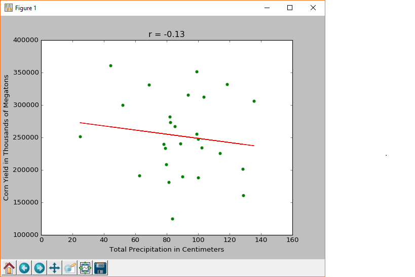

# DataAnalysis

Analyse data from 168 weather stations in USA to find Pearsons Correlation between the Average temperatures,total precipitaion and the Corn Yield.

Weather Data Description
------------------------

The wx_data folder has files containing weather data records from 1-Jan-1985 to 31-Dec-2014. Each file corresponds to a particular weather station from Nebraska, Iowa, Illinois, Indiana, or Ohio. 

Each line in the file contains 4 records separated by tabs: 

1. The date (YYYYMMDD format)
2. The maximum temperature for that day (in tenths of a degree Celsius)
3. The minimum temperature for that day (in tenths of a degree Celsius)
4. The amount of precipitation for that day (in tenths of a millimeter)

Yield Data Description
----------------------

The yld_data folder has a single file, US_corn_grain_yield.txt, containing a table of the total harvested corn grain yield in the United States measured in 1000s of megatons for the years 1985 - 2014.

To calculate the avergae maximum temperature, average minimum temperature and total precipitation for each year for all weather stations and the Pearson correlation between these variables and the grain yield data stored in US_corn_grain_yield.txt run analysis.py.

    $./analysis.py <operation to be performed> <input dir> <path to output file for average temperatures and total precipitation> <path to corn yiled data> <path to output file for pearsons correlations>
ex:

    $ ./analysis.py avg-corr wx_data "output/AveragesOut.out yld_data/US_corn_grain_yield.txt output/Correlation.out
To plot  the data and visualize linear regression for the average temperatures or the precipitation and the corn yield run analysis.py with additional arguments.The graph also displays the corresponsing Pearsons Correlation Co-efficient(r)
     
    $./analysis.py <operation to be performed> <input dir> <path to output file for average temperatures and total precipitation> <path to corn yiled data> <path to output file for pearsons correlations> <weather station code> <variable for x-axis> <variable for y-axis> 
ex:

    $ ./analysis.py avg-corr wx_data "output/AveragesOut.out yld_data/US_corn_grain_yield.txt output/Correlation.out USC00111280 Total_Prcp Yield

plot:

 
